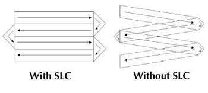

# Investigating Submarine Groundwater Discharge using Sea-Surface Temperature and K-Means Clustering

## Introduction & Description of Problem

Submarine Groundwater Discharge (SGD) is a major flux of terrestrial water to the ocean, and plays an important role in several processes. A large flux of nutrients is transported in the dissolved load of SGD, typically greater than the flux from rivers (Santos et al. 2021), influencing seawater biodiversity. This process is also affected by anthropogenic activities, with excess nutrient runoff from fertlizers causing eutrophicatin (D'Elia et al., 1981). The relative freshness of SGD compared to seawater also makes it ideal for desalination and human consumption where other sources of freshwater are not as readily available (Post et al., 2013).

Despite the importance of SGD, its occurance and behaviour has been poorly undrestood, and historically researchers have relied on in-situ measurements and modeling (Burnett et al., 2006). In recent decades, remote sensing has provided an enormous source of data with the potential for large scale observation of SGD. The data from the Landsat-5, 7 and 8 missions have proven especially popular among researchers. Machine learning algorithms such as K-means and Gaussian Mixture Models can aid in extracting results from the large datasets produced by these satelite missions.

One recent such study by Caineta et al. (2022) utilizes data from Landsat-7 and 8 to study SGD plumes off the coast of southern Ireland and Hawaii. They look at several variables including sea surface temperature (SST, using surface radiance in the infrared range) and seawater colour (utilizing radiance in the visual to near infrared range). SST values are clustered using a K-means algorithm, and the warmest two clusters are used to help identify SGD. By combining their observations of SST and color the authors identify potential SGD and confirm this with reliable in-situ measurements.

This final project for GEOL0069 is inspired by this paper, but to remain within the scope of this project, I have restricted myself to a single location, using only Landsat-7 data, and just SST classification. The goal is to use a K-means algorithm called ckmeans-1d-dp to seperate SST pixels into clusters based on temperature, preparing the data to be used in a larger process such as by Caineta et al.. ckmeans-1d-dp is a K-means algorithm optimised for univariate datasets, such as SST (Wang and Song, 2011). Like other K-means algorithms, it works by minimising within-class variance while maximizing between-class variance.

## Steps Taken

### 1. Obtaining Data

The remotely sensed data for this project was sourced from the Landsat-7 Mission. The Enhanced Thematic Mapper Plus (ETM+) instrument on board the satelite contained a thermal infrared channel that was a four-fold improvement on previous itterations and contained 8 different spectral bands. The most important here is the thermal band, that produced infra-red radiance measurements of the earth surface and can be used to calculate sea surface temperature. This band produced data with a 60m spatial resolution and is available as low- and high-gain products. We use the high-gain product as it has a higher sensitivity.

The bands 3 and 4 detect red and near infra-red light levels respectively, and were used to create land masks to focus just on SST (more later). These were available at 30m resolution. Additionally, DEM data from the Shuttle Radar Topography Mission (SRTM) was also obtained to be used for the land mask. This will also be explained later. All data was obtained through the USGS EarthExplorer interface.

The Landsat-7 satelite collected data until January 19, 2024. Most of our data is from 2023. Unfortunately, this means that the data has some slight gaps in it, due to the failure of the Scan Line Corrector (SLC) in 2003. The effects are illustrated in the images below and is seen in our results:

### 2. Calculating Sea Surface Temperature from Radiance

The first step for this was calibrating using the MTL metadata file associated with our Landsat-7 data. This involves parsing the MTL file to automatically find the values of maximum radiance and certain quantiles. We then convert from radiance to temperature (in Kelvin) using the following formulae:

$$
L_\lambda = \frac{(L_{\text{MAX}} - L_{\text{MIN}})}{(Q_{\text{CALMAX}} - Q_{\text{CALMIN}})} \cdot (Q_{\text{CAL}} - Q_{\text{CALMIN}}) + L_{\text{MIN}}
$$

$$
T = \frac{K_2}{\ln\left(\frac{K_1}{L_\lambda} + 1\right)}
$$

\begin{aligned}
Where: \\
L_\lambda & = \text{Spectral radiance at the sensor's aperture (W/(m}^2\cdot\text{sr}\cdot\mu\text{m))} \\
Q_{\text{CAL}} & = \text{Quantized calibrated pixel value (digital number, DN)} \\
L_{\text{MAX}}, L_{\text{MIN}} & = \text{Spectral radiance scales (max/min) for the band} \\
Q_{\text{CALMAX}}, Q_{\text{CALMIN}} & = \text{Maximum and minimum quantized calibrated values (usually 255 and 1)} \\
K_1, K_2 & = \text{Calibration constants for thermal conversion (from MTL file)} \\
T & = \text{brightness temperature (Kelvin)} \\
\end{aligned}

This is then converted to degrees Celcius, and plotted as Figure 1

### 3. Creating a Mask for Land

For SGD applications we are only interested in sea surface temperature, and as such the land surface temperature can result in skewed results as the land is typically much warmer than the sea. Therefore we need to find a way to create a water mask that allows us only to take water temperatures into account. To achieve this we use two methods. First, by using the red and infrared bands of Landsat 7, we can use the Normalised Difference Vegetation Index (NDVI) to differentiate between land and sea, where water is disinguished by NDVI values below -0.05. The following equation is used to calculate NDVI:

$$
\text{NDVI} = \frac{\text{NIR} - \text{RED}}{\text{NIR} + \text{RED}}
$$

Where:
- **NIR** is the reflectance in the near-infrared band
- **RED** is the reflectance in the red band

Additionally, a DEM can be created of the land and nearby sea, where elevation under 5 meters was considered to be ocean.

We also make the assumption that seawater temperatures will not exceed 35 degrees celcius. Along with this assumption and the DEM and NDVI masks we create a water mask, allowing us to focus on only SST.

A more interesting solution to this is to apply an unsupervised (or better yet, supervised) learning method to differentiate between land and sea. To stay within the scope of this project this was not performed.

### 4. Implementing K-Means Clustering
 
K-Means clustering is an unsupervised learning method, meaning its training data is not labelled (differentiating it from supervised learning methods). It is centroid based, and in this case the centroids are the mean value of each cluster. The algorithm works by maximising the distance between centroids, while minimizing the variance within the cluster associated with each centroid. One of the key metrics for this is the sum of squared errors, which represents variance within a dataset and is minimized by the algorithm. K-means is scaleable, fast and easy to understand machine learning method, which has made it one of the most popular. On the other hand, the method is sensitive to outliers, which is why the higher land temperatures in our area are masked.

We go a step further by choosing the ckmeans-1d-dp algorithm for this project. This algorithm is optmized for univariate (1-dimensional) applications, such as SST. Regular K-means applications, such as through the scikit-learn package are optimised for higher dimensional data. It originated with the ckmeans.1d.dp algorithm written for the R programming language (Wand and Song, 2011). Here we use a python interface ckmeans-1d-dp.

### 5. Plotting Results

The final step is to plot our results. First all five bands are plotted, then a seperate plot shows us the two warmest bands. These SST 'anomalies' are typically used alongside data of sea surface colour (indicating photosynthesis and therefore higher nutrient fluxes through groundwater). Together they can indicate potential subsurface groundwater discharge.
